# Creating the Slack app for sre-on-call

This guide creates the Slack app the Incident Investigator needs: a bot that
receives the alert that triggers an investigation, reads channel history to
correlate context, and posts incident reports and PIRs back in-thread.

The fastest path is the **app manifest** ([`slack-app/manifest.yaml`](slack-app/manifest.yaml)) —
one paste configures the bot user, scopes, slash command, and event
subscription. A manual click-through is in [Appendix A](#appendix-a--manual-setup-without-the-manifest).

## What the app needs, and why

| Capability | Value | Why |
|---|---|---|
| Bot scope `app_mentions:read` | OAuth | Receive the `app_mention` event that triggers an investigation |
| Bot scope `chat:write` | OAuth | Post the incident report / PIR back in the alert thread |
| Bot scope `channels:history` | OAuth | Slack Scanner reads history of **public** channels the bot is in |
| Bot scope `groups:history` | OAuth | Slack Scanner reads history of **private** channels the bot is in |
| Bot scope `commands` | OAuth | Required to register/run the `/postmortem` slash command |
| Event subscription `app_mention` | Events API | Delivers the triggering mention to the Lambda function URL |
| Slash command `/postmortem` | Commands | Generates a Post-Incident Report from an incident thread |
| Signing secret | Credentials | Lambda verifies every request's HMAC signature (`SLACK_SIGNING_SECRET`) |
| Bot User OAuth token (`xoxb-…`) | Credentials | Lambda + scanner call the Slack Web API (`SLACK_BOT_TOKEN`) |

Both credentials are stored in AWS Secrets Manager via
[`scripts/hydrate_secrets.sh`](../scripts/hydrate_secrets.sh); nothing is kept in
the repo.

## Prerequisites

- Permission to create and install an app in your Slack workspace (workspace
  settings may require an admin to approve the install).
- The deployed Lambda **function URL** — this is the Request URL for both the
  event subscription and the slash command:
  ```bash
  cd terraform && AWS_PROFILE=<profile> terraform output -raw lambda_function_url
  # e.g. https://abc123.lambda-url.us-east-1.on.aws/
  ```
  You can create the app before the endpoint is live (see the ordering note in
  step 4) and fill the URL in afterwards.

## Ordering: secret before event verification

Slack verifies the event-subscription Request URL by POSTing a **signed**
`url_verification` challenge. The Lambda checks that signature against the
app's signing secret, so verification only turns green once:

1. the app exists (so it has a signing secret), **and**
2. that signing secret is hydrated into Secrets Manager and the Lambda is live.

So the real order is: **create the app → copy its signing secret + bot token →
`hydrate_secrets.sh` → then enable Event Subscriptions.** The steps below follow
that order.

## Step-by-step (manifest)

### 1. Create a new app

Go to <https://api.slack.com/apps> and click **Create New App**.

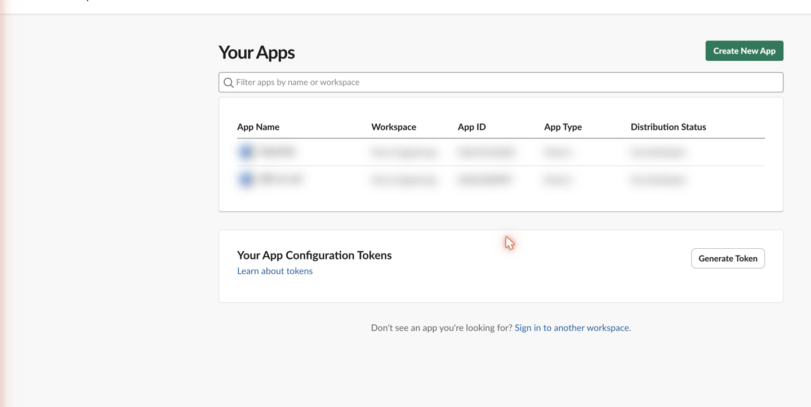

### 2. Choose "From an app manifest"

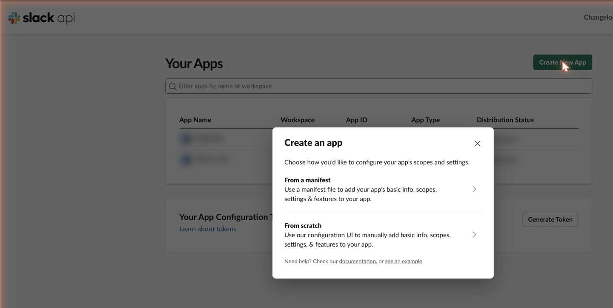

### 3. Pick the workspace

Select the workspace the bot will run in, then **Next**.

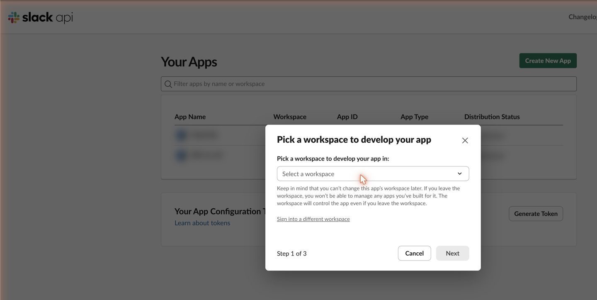

### 4. Paste the manifest

Switch to the **YAML** tab and paste the contents of
[`slack-app/manifest.yaml`](slack-app/manifest.yaml). **Replace both
`https://YOUR-FUNCTION-URL…` placeholders** with your Lambda function URL.

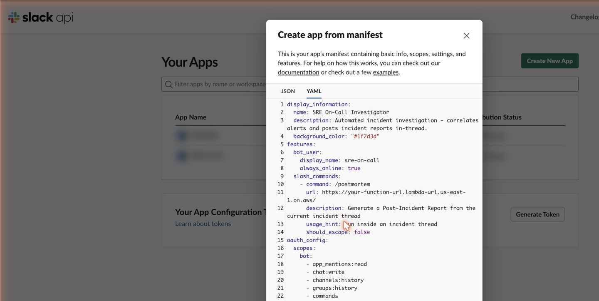

> **If the endpoint isn't live yet**, delete the entire
> `settings.event_subscriptions:` block before pasting. Slack tries to verify
> that Request URL on creation and the app won't create until the challenge
> succeeds. Add event subscriptions back in step 9 after hydrating the secret.

Click **Next**, review the summary, then **Create**.

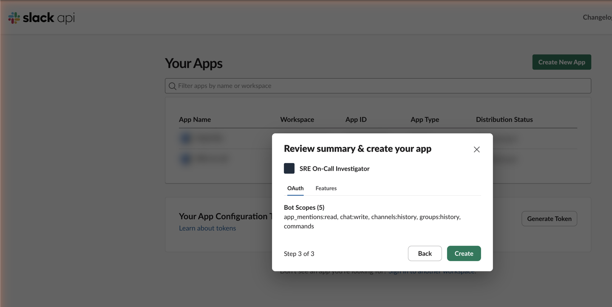

### 5. Install to the workspace

Open **Install App** (or **OAuth & Permissions**) and click **Install to
Workspace**.

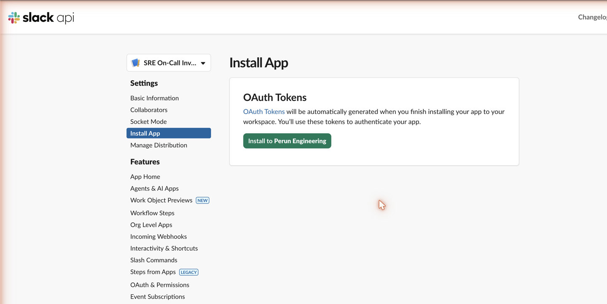

Review the permissions and click **Allow**.

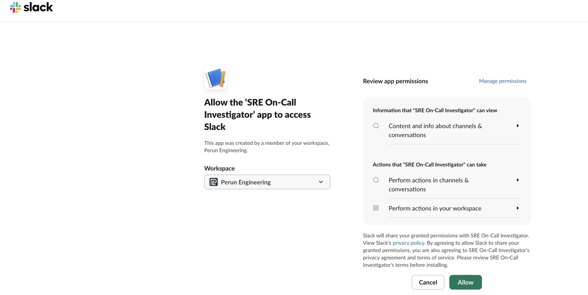

### 6. Copy the Bot User OAuth token

On **OAuth & Permissions**, copy the **Bot User OAuth Token** (`xoxb-…`). This
is `SLACK_BOT_TOKEN`.

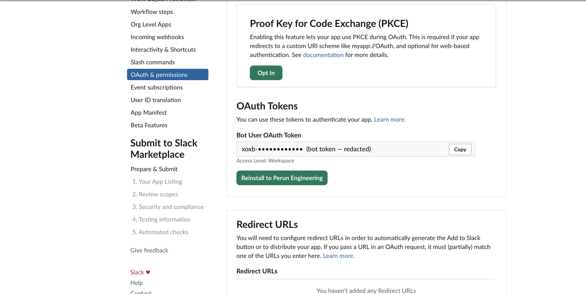

Scroll down to **Scopes → Bot Token Scopes** and confirm all five are present
(`app_mentions:read`, `chat:write`, `channels:history`, `groups:history`,
`commands`).

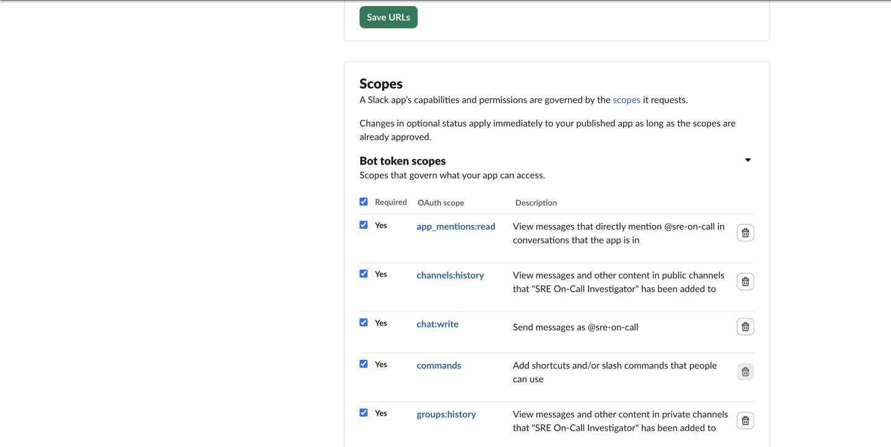

### 7. Copy the signing secret

On **Basic Information → App Credentials**, reveal and copy the **Signing
Secret**. This is `SLACK_SIGNING_SECRET`.

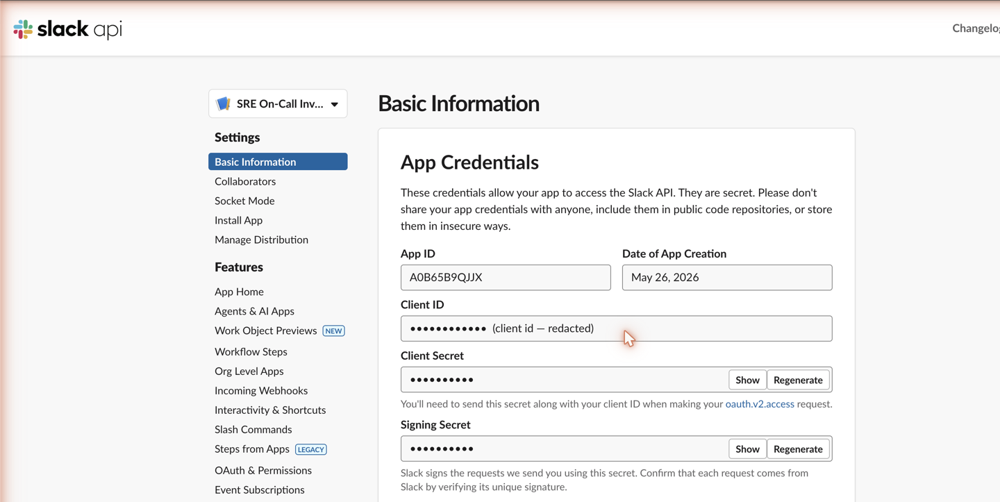

### 8. Hydrate the secrets

```bash
AWS_PROFILE=<profile> \
SLACK_BOT_TOKEN=xoxb-… \
SLACK_SIGNING_SECRET=… \
  ./scripts/hydrate_secrets.sh
```

The Lambda resolves secrets on every invocation, so this takes effect with no
redeploy.

### 9. Enable Event Subscriptions

On **Event Subscriptions**, toggle **Enable Events** on and paste your function
URL into **Request URL**. Slack sends the challenge; once the Lambda answers it,
the field shows a green **Verified ✓**. Under **Subscribe to bot events**,
confirm `app_mention` is listed, then **Save Changes**.

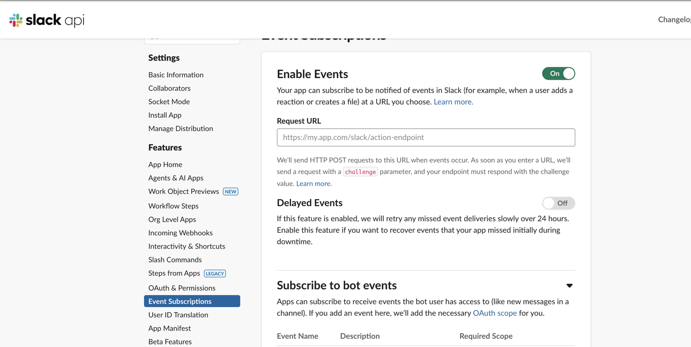

> Not verifying? It's almost always the signing secret — make sure step 8 ran
> against the **same** app's secret, and that the function URL is correct.

### 10. Confirm the slash command

The manifest already created `/postmortem` pointing at your function URL. Check
it under **Slash Commands**.

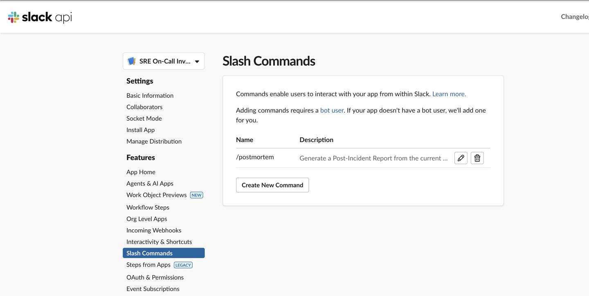

### 11. Invite the bot to channels

The scanner only sees channels the bot is a member of. In each channel you want
investigated:

```
/invite @sre-on-call
```

## Verify

Mention the bot on an alert-shaped message in a channel it's in:

```
@sre-on-call ALERT: high CPU on api-server
```

It should reply in-thread with an "Investigation Started" message. Or run the
synthetic webhook from [`docs/testing.md`](testing.md):

```bash
SLACK_SIGNING_SECRET=… ./scripts/synthetic_slack_webhook.py \
    --url "$(cd terraform && terraform output -raw lambda_function_url)" \
    --channel <channel-id> --team <team-id>
```

## Rotating credentials

Reissue the bot token (**OAuth & Permissions → Rotate**, or reinstall) or the
signing secret (**Basic Information → Regenerate**), then re-run
`hydrate_secrets.sh` — see the secret-rotation section of
[`docs/deployment.md`](deployment.md). If you change scopes, **reinstall** the
app; Slack tokens don't pick up new scopes until reinstall.

---

## Appendix A — Manual setup without the manifest

Use this if you'd rather click through each screen.

1. **Create New App → From scratch.** Name it `SRE On-Call Investigator`, pick
   the workspace, **Create App**.
2. **OAuth & Permissions → Scopes → Bot Token Scopes.** Add `app_mentions:read`,
   `chat:write`, `channels:history`, `groups:history`, `commands`. (Adding the
   slash command in step 4 also adds `commands` automatically.)
3. **App Home → App Display Name.** Set the bot username to `sre-on-call` and
   toggle the bot user on if prompted.
4. **Slash Commands → Create New Command.** Command `/postmortem`, Request URL =
   your function URL, short description, usage hint `run inside an incident
   thread`, **Save**.
5. **Install App → Install to Workspace → Allow.** Copy the Bot User OAuth
   Token (`SLACK_BOT_TOKEN`).
6. **Basic Information → App Credentials.** Copy the Signing Secret
   (`SLACK_SIGNING_SECRET`). Run `hydrate_secrets.sh` (step 8 above).
7. **Event Subscriptions → Enable Events.** Request URL = your function URL;
   wait for **Verified ✓**. Under **Subscribe to bot events**, add `app_mention`.
   **Save Changes**.
8. **Invite the bot** to each channel: `/invite @sre-on-call`.
